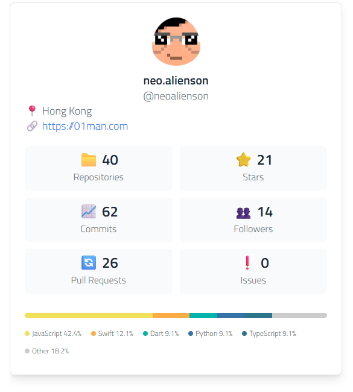

# hexo-github-card-inline

A Hexo plugin to render GitHub user and repository cards inline.

## Installation

```bash
npm install hexo-github-card-inline
```

## How to Use

1. **Install the plugin** using npm (see Installation above)
2. **Restart your Hexo server** to load the plugin
3. **Add GitHub cards to your posts or pages** using the `` tag
4. **Generate your site** with `hexo generate` or `hexo server`

## Usage

### User Card

```

```

Sample:



### Repository Card
```

```


### With Custom Styling
```


```

## Parameters

- `user` - GitHub user name (required)
- `repo` - GitHub repository name (optional, shows user profile if omitted)
- `height` - Widget height in px (optional, default: 200)
- `width` - Widget width in px (optional, default: 400)
- `align` - Text alignment (optional, default: center)

## Configuration

Add configuration to your `_config.yml`:

```yaml
github_card:
  api_token: your_github_token_here  # Optional: GitHub API token for higher rate limits
  inject_css: false                 # Optional: Disable automatic CSS injection
  priority: 10                      # Optional: Filter execution priority (default: 10)
```

⚠️ **Security Warning:** Never commit your GitHub API token to your repository. Use environment variables (eg, [plugin](https://github.com/wenonly/hexo-dynamic-config)) or keep your `_config.yml` out of version control when using tokens.

**GitHub API Token Benefits:**
- Higher rate limits (5000 requests/hour vs 60 requests/hour)
- Access to private repository data (if token has permissions)
- Better reliability for high-traffic sites

## CSS Styling

### Automatic CSS Injection (Default)

CSS styles are automatically injected when the plugin is used. No manual setup required.

### Manual CSS Integration

To use the CSS in your theme instead of automatic injection:

1. **Disable automatic injection** in your `_config.yml`:
   ```yaml
   github_card:
     inject_css: false
   ```

2. **Copy CSS to your theme**:
   - Copy the contents of `github-card.css` from the plugin directory
   - Add it to your theme's CSS file
   - Or include it as a separate CSS file in your theme

### Custom Styling

You can override the default styles by adding custom CSS rules in your theme. All GitHub card elements use the `.github-card` prefix for easy targeting.

**Benefits of manual integration:**
- Better performance (no runtime CSS injection)
- Full control over styling
- Integration with your theme's build process
- Ability to customize colors, fonts, and layout